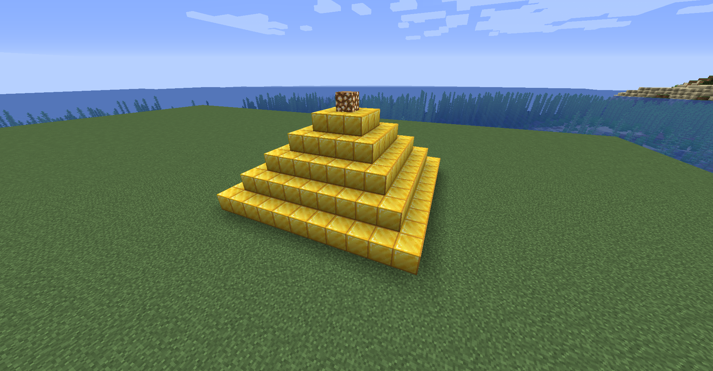

# minecraft_remote_itkids

Minecraft APIs made by IT Kids

## ----**07_YS violet4y API**----

ピラミッドを作るコード

[](./images/api.png)[](./images/diagonal-pyramids.png)


## [api_violet4y.py](api_violet4y.py)
ピラミッドを作るコードです。x,y,zの座標、高さ、作成速度を設定できます。

```
pyramid.set_pyramid(pyramidtype=1, X=10, Y=63, Z=10, H=6, SLEEP=0.5, BLOCK=param.GOLD_BLOCK)
```
```
pyramid.set_pyramid_diagonal(X=10, Y=63, Z=10, H=5, SLEEP=0.1, BLOCK=param.GOLD_BLOCK)
```

## --**コードについて** <set_pyramid>--
---

## *pyramidtype*

pyramidtype=1   ---row---  
1列ずつ作成します。

[](./images/api_row.png)


pyramidtype=2  ---block---  
1ブロックずつ作成します。

[](./images/api_block.png)

## *X,Y,Z,H*

ピラミッドを作る座標を決めます。
指定した座標から  
xのプラス方向へ、yのプラス方向へ、zのプラス方向へと作成します。
Hに数値を入れることでピラミッドの高さが決まります。

| H | 4 | 5 | 6 | 7 |
|:---|:---:|:---:|:---:|:---:|
|横幅|7|9|11|13|
|画像|[](./images/pyramid-4height.png)|[](./images/pyramid-5height.png)|[](./images/pyramid-6height.png)|[](./images/pyramid-7height.png)|

## *SLEEP*

列やブロックを設置した後、次に設置するまでも待機秒数です。

## *BLOCK*

ピラミッドを構築するブロックを指定できます。

|param.IRON_BLOCK|param.GOLD_BLOCK|param.DIAMOND_BLOCK|
|---|---|---|
|[](./images/pyramid-iron.png)|[](./images/pyramid-gold.png)|[](./images/pyramid-diamond.png)|

---
## --**コードについて** <set_pyramid_diagonal>--

| H | 4 | 5 | 6 | 7 |
|:---|:---:|:---:|:---:|:---:|
|横幅|7|9|11|13|
|画像|[](./images/dia-4hei.png)|[](./images/dia-5hei.png)|[](./images/dia-6hei.png)|[](./images/dia-7hei.png)|